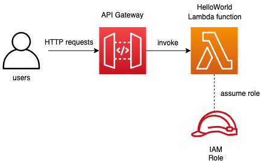
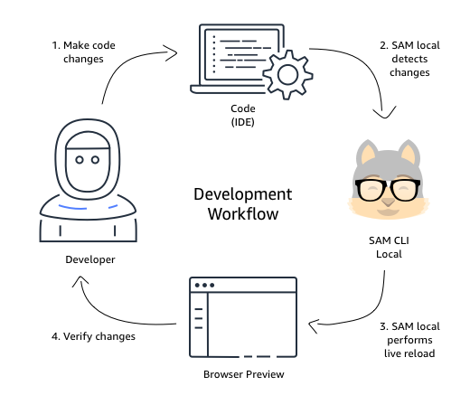

# Install sam_cli 
[sam_cli](https://docs.aws.amazon.com/serverless-application-model/latest/developerguide/install-sam-cli.html)

### Initialize the sam_cli
```sam init```

```
	SAM CLI now collects telemetry to better understand customer needs.

	You can OPT OUT and disable telemetry collection by setting the
	environment variable SAM_CLI_TELEMETRY=0 in your shell.
	Thanks for your help!

	Learn More: https://docs.aws.amazon.com/serverless-application-model/latest/developerguide/serverless-sam-telemetry.html


You can preselect a particular runtime or package type when using the `sam init` experience.
Call `sam init --help` to learn more.

Which template source would you like to use?
	1 - AWS Quick Start Templates
	2 - Custom Template Location
Choice: 1

Choose an AWS Quick Start application template
	1 - Hello World Example
	2 - Data processing
	3 - Hello World Example with Powertools for AWS Lambda
	4 - Multi-step workflow
	5 - Scheduled task
	6 - Standalone function
	7 - Serverless API
	8 - Infrastructure event management
	9 - Lambda Response Streaming
	10 - Serverless Connector Hello World Example
	11 - Multi-step workflow with Connectors
	12 - GraphQLApi Hello World Example
	13 - Full Stack
	14 - Lambda EFS example
	15 - DynamoDB Example
	16 - Machine Learning
Template: 1

Use the most popular runtime and package type? (Python and zip) [y/N]: y

Would you like to enable X-Ray tracing on the function(s) in your application?  [y/N]: y
X-Ray will incur an additional cost. View https://aws.amazon.com/xray/pricing/ for more details

Would you like to enable monitoring using CloudWatch Application Insights?
For more info, please view https://docs.aws.amazon.com/AmazonCloudWatch/latest/monitoring/cloudwatch-application-insights.html [y/N]: y
AppInsights monitoring may incur additional cost. View https://docs.aws.amazon.com/AmazonCloudWatch/latest/monitoring/appinsights-what-is.html#appinsights-pricing for more details

Would you like to set Structured Logging in JSON format on your Lambda functions?  [y/N]: y
Structured Logging in JSON format might incur an additional cost. View https://docs.aws.amazon.com/lambda/latest/dg/monitoring-cloudwatchlogs.html#monitoring-cloudwatchlogs-pricing for more details

Project name [sam-app]: hello_world

Cloning from https://github.com/aws/aws-sam-cli-app-templates (process may take a moment)

    -----------------------
    Generating application:
    -----------------------
    Name: hello_world
    Runtime: python3.9
    Architectures: x86_64
    Dependency Manager: pip
    Application Template: hello-world
    Output Directory: .
    Configuration file: hello_world/samconfig.toml

    Next steps can be found in the README file at hello_world/README.md


Commands you can use next
=========================
[*] Create pipeline: cd hello_world && sam pipeline init --bootstrap
[*] Validate SAM template: cd hello_world && sam validate
[*] Test Function in the Cloud: cd hello_world && sam sync --stack-name {stack-name} --watch```

### Project Architecture



### Run SAM locally



``` Install the necessary dependencies for the applications ```

```pip install -r requirements.txt```

### Run using SAM CLI

Moving into the directory where the sam application is located

Invoke a lambda function

```sam local invoke --event events/event.json```

### Running a local HTTP server that simulates API Gateway
1
2
